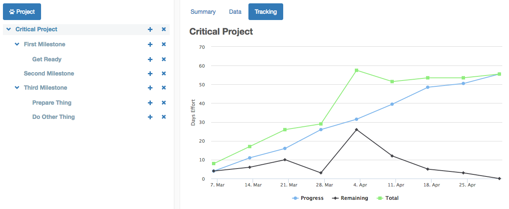

# Perro Project

Perro Project is a lightweight project management tool for tracking effort estimates and velocity.

Live demo: [robertwrose.com/perro](http://www.robertwrose.com/perro)

## Data security and storage

Data is stored in your local web browser's cache (``window.localStorage``). No data is transferred outside your browser to
run the application. The data is protected so long as you don't uninstall your browser.

The raw data may be backed up by visiting the 'data' page and copying the json blob at the bottom of the page, or
using a Chrome plugin like Storage Explorer.

## License

BSD License

Copyright (c) 2016 Robert W. Rose
All rights reserved.
